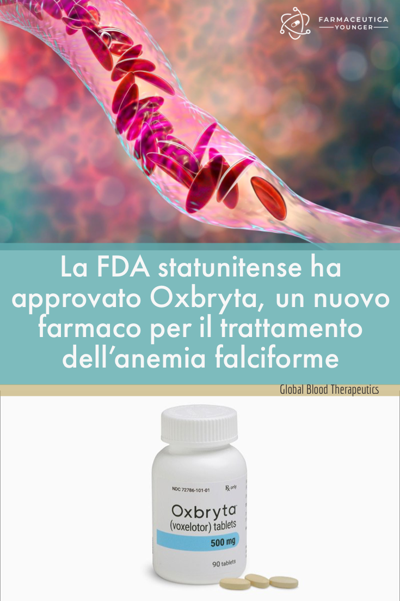

La Food and Drug Administration degli Stati Uniti ha concesso un'approvazione accelerata a [Oxbryta (voxelotor)](https://www.fda.gov/news-events/press-announcements/fda-approves-novel-treatment-target-abnormality-sickle-cell-disease) per il trattamento dell'anemia falciforme (SCD, sickle cell disease) negli adulti e nei pazienti pediatrici di età pari o superiore a 12 anni.

Circa 100.000 persone negli Stati Uniti e oltre 20 milioni in tutto il mondo convivono con questo debilitante disturbo.

L'anemia falciforme è una malattia genetica del sangue in cui i globuli rossi assumono una forma anomala (a forma di mezzaluna o "falce"), che limita il flusso nei vasi sanguigni e il rilascio di ossigeno ai tessuti del corpo, causando un forte dolore e danni diffusi agli organi del corpo. I globuli rossi anomali possono causare anche l’ostruzione di capillari e piccoli vasi sanguigni che, di conseguenza, provoca attacchi dolorosi e improvvisi dovuti ad un blocco della circolazione sanguigna nei vari organi.

**Voxelotor** è una piccola molecola che si lega all'emoglobina e aumenta l'affinità della proteina con l'ossigeno. Aiutando l'emoglobina a rimanere nello stato ossigenato, voxelotor inibisce la polimerizzazione dell'emoglobina e previene la deformazione dei globuli rossi. Studi non clinici hanno dimostrato che migliorando la deformabilità dei globuli rossi, migliora così la capacità del sangue di fluire.

L'approvazione di Oxbryta si basava sui risultati di una sperimentazione clinica condotta su 274 pazienti con anemia falciforme. Nello studio, 90 pazienti hanno ricevuto 1500 mg di Oxbryta, 92 pazienti hanno ricevuto 900 mg di Oxbryta e 92 pazienti hanno ricevuto un placebo. L'efficacia si è basata su un aumento del tasso di risposta all'emoglobina nei pazienti che avevano ricevuto 1500 mg di Oxbryta, che era del 51,1% per questi pazienti rispetto al 6,5% nel gruppo placebo.

Oxbryta ha ottenuto l' approvazione accelerata , che consente alla FDA di approvare farmaci per condizioni gravi per soddisfare un'esigenza medica insoddisfatta sulla base di un risultato che è ragionevolmente probabile che preveda un beneficio clinico per i pazienti. Saranno necessari ulteriori studi clinici per verificare i benefici clinici di Oxbryta.

La FDA ha concesso a questa applicazione la designazione Fast Track. Oxbryta ha anche ricevuto la designazione di farmaco orfano, che fornisce incentivi per assistere e incoraggiare lo sviluppo di farmaci per le malattie rare.

La FDA ha concesso l'approvazione di Oxbryta a Global Blood Therapeutics.
