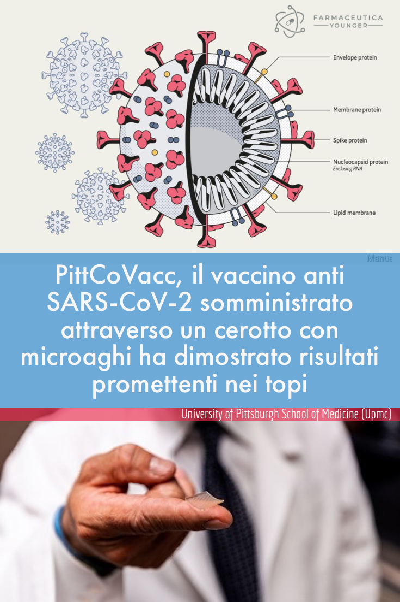

I ricercatori della University of Pittsburgh School of Medicine (Upmc) hanno annunciato i primi risultati promettenti su modelli animali di un vaccino anti SARS-CoV-2, somministrato attraverso un cerotto dotato di micro aghi delle dimensioni di un polpastrello.

Il lavoro è comparso il 2 aprile su [EBioMedicine](<https://www.thelancet.com/pdfs/journals/ebiom/PIIS2352-3964(20)30118-3.pdf>), rivista pubblicata da The Lancet.

I ricercatori hanno pensato ad un approccio innovativo per aumentarne la potenza che consiste nel somministrare il vaccino attraverso l’impiego di una matrice a micro aghi (_microneedle array_). Si tratta di un cerotto con 400 minuscoli aghi che somministrano frammenti della proteina spike attraverso la cute. Il dispositivo si utilizza come un normale cerotto e i micro aghi, fatti interamente di glucosio e proteine si dissolvono nella pelle.

Dopo essere stato testato sui modelli animali, si è potuto notare che il **PittCoVacc** (nome dato dai ricercatori al vaccino, abbreviazione di Pittsburgh CoronaVirus Vaccine) ha generato una "grande quantità di anticorpi" contro il SARS-CoV-2 dopo due settimane di trattamento. Il vaccino non è ancora stato valutato sul lungo termine, ma i ricercatori sottolineano come i topi ai quali è stato somministrato il vaccino contro MERS ha prodotto un livello sufficiente di anticorpi per neutralizzare il virus per almeno un anno, e finora i livelli di anticorpi nei modelli vaccinati contro SARS-CoV-2 sembrano seguire lo stesso andamento.

Inoltre, il sistema è altamente scalabile. I pezzi proteici sono prodotti da una "cell factory" (strati su strati di cellule coltivate progettate per esprimere la proteina spike di SARS-CoV-2) che possono essere impilati ulteriormente per moltiplicare la resa. Anche la purificazione della proteina può essere effettuata su scala industriale. La produzione in serie della matrice di microneedle implica la centrifugazione della miscela di proteine ​​e zuccheri in uno stampo. Una volta prodotto, il vaccino può rimanere a temperatura ambiente, eliminando così la necessità di refrigerazione durante il trasporto o lo stoccaggio.

I ricercatori hanno presentato la richiesta di approvazione del nuovo vaccino alla Food and Drug Administration statunitense in previsione di iniziare uno studio clinico di fase I sui primi volontari sani nei prossimi mesi.
