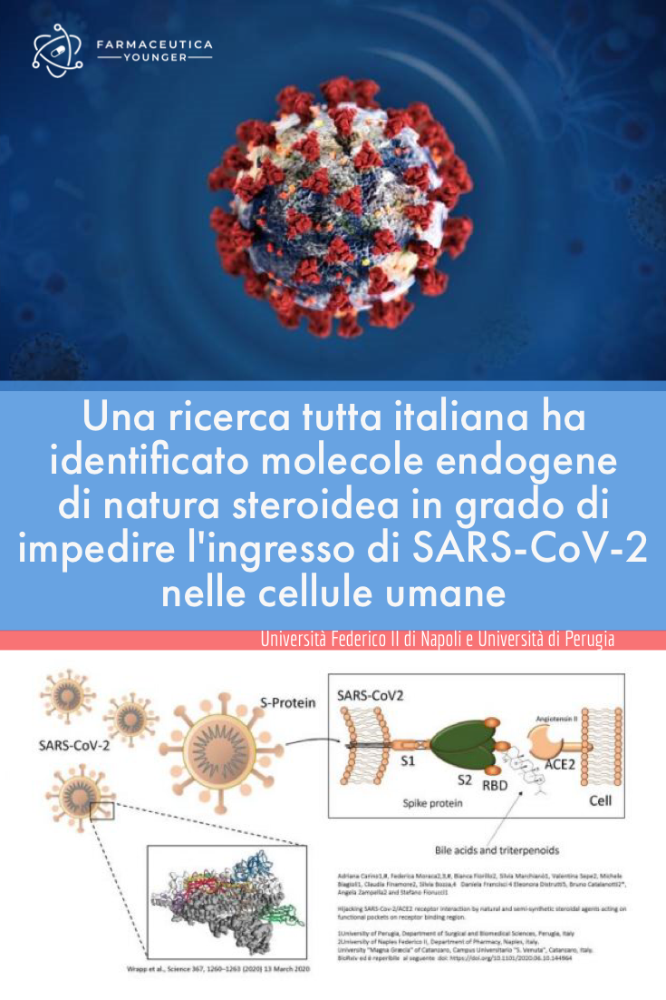

I ricercatori dell'Università Federico II di Napoli e dell'Università di Perugia hanno identificato [molecole endogene in grado di impedire l'ingresso di SARS-CoV-2 nelle cellule umane.](http://www.unina.it/-/22245970-nuovi-approcci-molecolari-al-trattamento-dellinfezione-da-sars-cov2-covid-19-)

Lo studio è stato pubblicato in pre-print sul sito BioRxiv.

Gli studi alla base di questa scoperta derivano da vari gruppi di ricerca che hanno mostrato come la mutazione della proteina Spike di SARS-CoV-2 conferisce al virus affinità per una sequenza proteica complementare localizzata sulla regione carbossipeptidasica del recettore umano ACE 2 (Angiotensin Converting Enzyme 2), un recettore che metabolizzando l'angiotensina II porta alla produzione di angiotensina 1-7. Il legame con il recettore è necessario affinché un altro enzima, TMPRSS2, separi la sequenza S1 da S2 di Spike. La porzione S2 della proteina una volta esposta aggancia la membrana cellulare dell'ospite dando inizio al meccanismo molecolare di ingresso del virus.

Nell'indagare il meccanismo di azione del virus i ricercatori hanno scoperto che l'organismo è in grado di mettere in campo contromisure non immunologiche, ovvero grazie a molecole endogene di natura steroidea non derivanti dalla risposta immunitaria, che legando alcune regioni localizzate nell' RBD di Spike ne prevengono il legame con ACE2, impendendo l'ingresso del virus nelle cellule bersaglio.

I ricercatori ritengono molto probabile che l'approccio sviluppato non consentirà di trattare pazienti con quadri gravi di distress respiratorio, perché gli anticorpi del siero iperimmune ottenuto da pazienti guariti da COVID-19 sono molto più efficaci nell' inibire il legame tra Spike e ACE2 delle molecole scoperte. Tuttavia, queste molecole endogene hanno un punto a favore, un consolidato profilo di sicurezza, che ne consentirebbe un uso immediato nei pazienti con COVID-19. Questo approccio, potrebbe quindi consentire di ridurre le tempistiche dei trial clinici.

Lo studio verrà proposto all'attenzione di AIFA.
