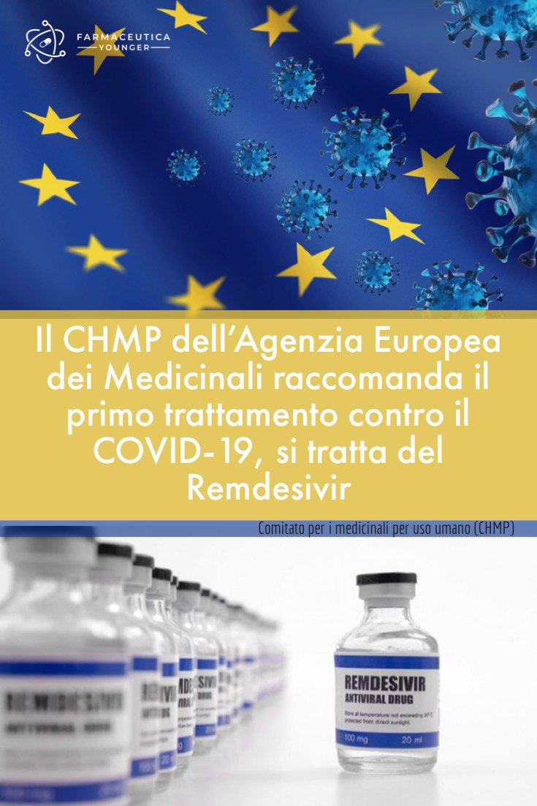

Il comitato per i medicinali per uso umano dell'EMA (CHMP) ha raccomandato l'autorizzazione all'immissione in commercio condizionata a [Veklury (remdesivir)](https://www.ema.europa.eu/en/news/first-covid-19-treatment-recommended-eu-authorisation) per il trattamento di COVID-19 in adulti e adolescenti di età pari o superiore a 12 anni con polmonite che necessitano di ossigeno supplementare.

Remdesivir è il primo medicinale contro COVID-19 ad essere raccomandato per l'autorizzazione nell'UE.

I dati su remdesivir sono stati valutati in un tempo eccezionalmente breve attraverso una procedura di revisione continua, un approccio utilizzato dall'EMA durante le emergenze di sanità pubblica per valutare i dati non appena disponibili. Dal 30 aprile 2020, il CHMP ha iniziato a valutare i dati sulla qualità e sulla produzione, i dati non clinici, i dati clinici preliminari e i dati di sicurezza a sostegno dei programmi di uso compassionevole, con largo anticipo rispetto alla presentazione della domanda di autorizzazione all'immissione in commercio il 5 giugno.

Il parere positivo del CHMP si basa principalmente sui dati dello [studio NIAID-ACTT-11](https://www.niaid.nih.gov/news-events/nih-clinical-trial-shows-remdesivir-accelerates-recovery-advanced-covid-19), sponsorizzato dal National Institute of Allergy and Malattie infettive (NIAID) degli Stati Uniti, oltre a dati di supporto provenienti da altri studi su remdesivir. Lo studio NIAID-ACTT-1 ha valutato l'efficacia del trattamento di remdesivir della durata di 10 giorni in oltre 1.000 pazienti ospedalizzati con COVID-19.

Remdesivir è stato confrontato con placebo e la principale misura dell'efficacia si è basata sul tempo di recupero dei pazienti (definito come il non essere più ricoverato in ospedale e/o richiedere ossigeno a casa o essere ricoverato in ospedale ma non richiedere ossigeno supplementare e non richiedere più cure mediche).

Nel complesso, lo studio ha mostrato che i pazienti trattati con remdesivir hanno avuto dei miglioramenti dopo circa 11 giorni, rispetto ai 15 giorni per i pazienti trattati con placebo. Questo effetto non è stato osservato nei pazienti con malattia da lieve a moderata: il tempo per il recupero è stato di 5 giorni sia per il gruppo trattato con remdesivir che per il gruppo trattato con placebo.

Per i pazienti con malattia grave, che costituivano circa il 90% della popolazione dello studio, il tempo necessario per il recupero era di 12 giorni nel gruppo remdesivir e 18 giorni nel gruppo placebo. Tuttavia, non è stata osservata alcuna differenza nel tempo al recupero nei pazienti che hanno iniziato a usare remdesivir quando erano già sottoposti a ventilazione meccanica o ECMO (ossigenazione extracorporea della membrana). I dati sulla percentuale di pazienti deceduti fino a 28 giorni dopo l'inizio del trattamento sono attualmente in raccolta per l'analisi finale.

Prendendo in considerazione i dati disponibili, l'Agenzia ha valutato il rapporto rischio beneficio positivo nei pazienti con polmonite che richiedono ossigeno supplementare vale a dire i pazienti con malattia grave.

A Remdesivir è stata quindi concessa un'autorizzazione all'immissione in commercio condizionata, uno dei meccanismi normativi dell'UE utilizzato per facilitare l'accesso anticipato ai medicinali che soddisfano un'esigenza medica insoddisfatta, anche in situazioni di emergenza in risposta a minacce per la salute pubblica come l'attuale pandemia. Questo tipo di approvazione consente all'Agenzia di raccomandare un farmaco per l'autorizzazione all'immissione in commercio con dati meno completi di quanto normalmente previsto, se il beneficio della disponibilità immediata di un farmaco per i pazienti supera il rischio dovuto al fatto che non tutti i dati sono ancora disponibili.

Al fine di valutare in maniera più completa l'efficacia e la sicurezza di remdesivir, la società dovrà presentare all'Agenzia le relazioni finali degli studi su remdesivir entro dicembre 2020 e ulteriori dati sulla qualità del medicinale, nonché i dati finali sulla mortalità, entro agosto 2020.

Come per tutti i medicinali, un piano di gestione dei rischi (RMP) garantirà un rigoroso monitoraggio della sicurezza di remdesivir una volta autorizzato in tutta l'UE. Ulteriori dati di efficacia e sicurezza saranno raccolti attraverso studi in corso e rapporti post-marketing e saranno periodicamente rivisti dal CHMP e dal comitato di sicurezza dell'EMA (PRAC).

Seguirà a breve la decisione della Commissione europea nella prossima settimana, consentendo in caso di esito positivo la commercializzazione del prodotto nell'UE.
