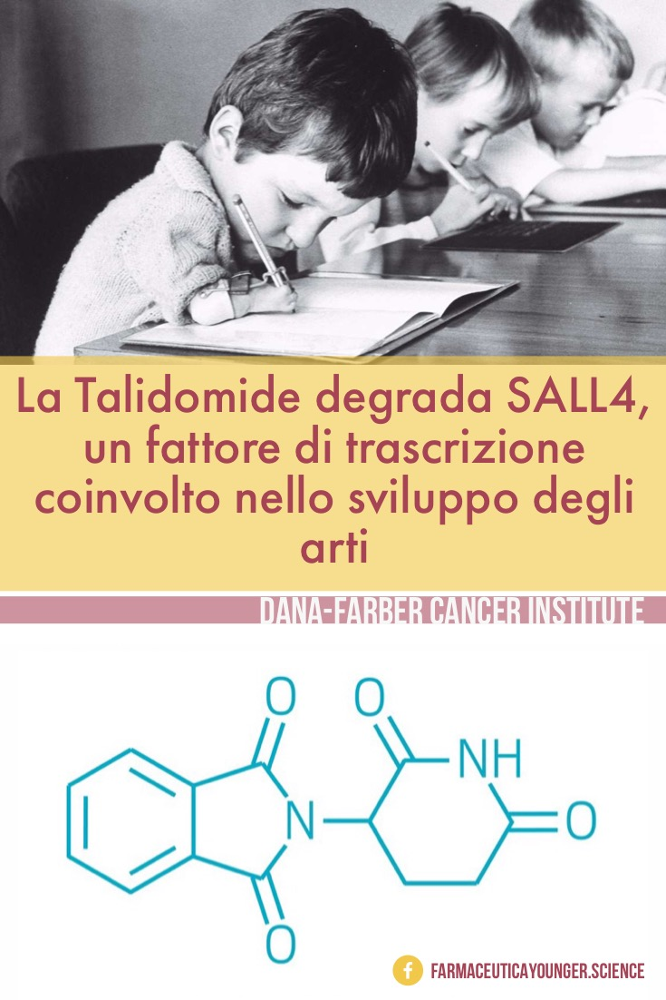

Uno studio condotto dai ricercatori del _Dana-Farber Cancer Institute_ ha scoperto che la **talidomide** potrebbe indurre teratogenicità **degrada**ndo una proteina chiave nel suo meccanismo antitumorale, **SALL4**, un membro della famiglia Spalt-like (SALL), **un fattore di trascrizione coinvolto nello sviluppo degli arti. **

Entrata in commercio negli anni cinquanta per curare la nausea mattutina nelle donne incinte, la talidomide ha portato alla nascita di migliaia di bambini con gravi malformazioni congenite dello sviluppo degli arti. Nonostante la sua teratogenicità, la talidomide così come i farmaci IMiDs (analoghi immunomodulatori della talidomide) sono tuttora un pilastro del trattamento del cancro. Tuttavia, le basi molecolari alla base della biologia pleiotropica e dei difetti alla nascita causati da questi farmaci rimangono tutt'ora sconosciute.

Nell'uomo, le mutazioni di SALL4 portano a una sindrome da deformazione agli arti che assomiglia ai difetti alla nascita indotti dalla talidomide, la _Sindrome Duane-radial ray_ (DRRS). I ricercatori sospettano che SALL4 abbia un ruolo chiave nella patogenesi della talidomide. Sebbene le prove suggeriscano che SALL4 sia un obiettivo principale nei difetti alla nascita indotti da talidomide, potrebbero esserci altri bersagli e effetti combinati di più bersagli in gioco. Ulteriori studi saranno necessari per approfondire o cercare di comprendere a pieno il meccanismo d'azione della talidomide.

Fonte: https://www.ncbi.nlm.nih.gov/pubmed/30067223
