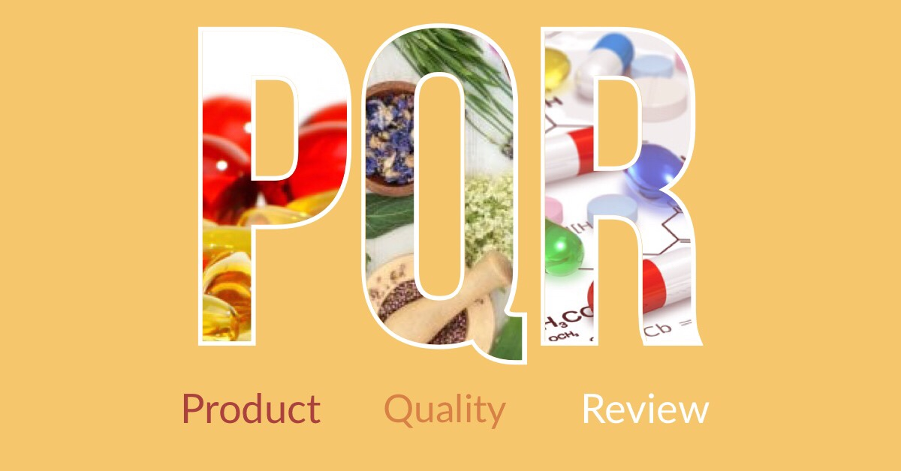

Il **PQR** o **Product Quality Review** è un documento obbligatorio, richiesto dalle cGMP che ogni azienda farmaceutica deve preparare per ogni prodotto autorizzato. Consiste in una valutazione annuale di una preparazione farmaceutica, che guarda indietro a dati di produzione e controllo qualità per valutare i cambiamenti, le tendenze e le sue debolezze mediante l'analisi delle deviazioni, change control, reclami, richiami del prodotto dal mercato ecc... É uno strumento potente per misurare ed ottimizzare non solo la qualità dei prodotti ma anche per l’efficienza dei processi farmaceutici.
