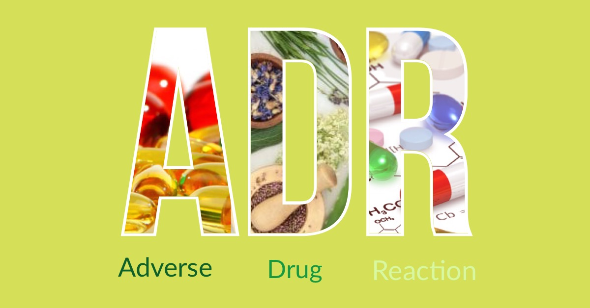

Una **reazione avversa al farmaco**, in inglese **ADR** ovvero**Adverse Drug Reaction,** così come viene definita dall’Organizzazione Mondiale della Sanità (WHO), è qualsiasi effetto nocivo, non voluto, ed indesiderato di farmaco.

Tale definizione include:

• l'uso conforme alle indicazioni contenute nell’autorizzazione all’immissione in commercio del medicinale (AIC)

• l'uso non conforme alle indicazioni contenute nell'autorizzazione all'immissione in commercio (off-label, cioè indicazioni non presenti nel foglietto illustrativo) quali sovradosaggio, uso improprio o abuso del medicinale

• errori terapeutici

• associazione all’esposizione per motivi professionali.
