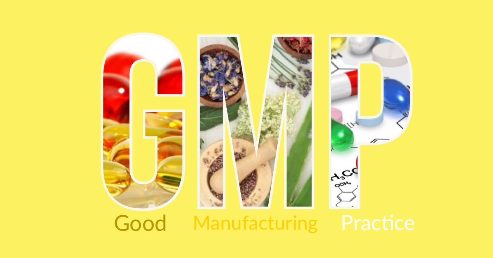

Le Good Manufacturing Practice (GMP), ovvero le Norme di Buona Fabbricazione dei Medicinali sono un insieme di regole che descrivono i metodi, le attrezzature, i mezzi e la gestione delle produzioni per assicurarne gli standard di qualità appropriati. Sviluppate in primo luogo per i prodotti farmaceutici, la loro applicazione si estende a alimenti, dispositivi medici, derivati biologici e cosmetici.

Le GMP si esplicano fondamentalmente attraverso le seguenti attività:

- Documentazione di ogni aspetto, ogni attività ed ogni operazioneo del processo
- Personale formato e addestrato
- Attività pianificate di pulizia e sanitizzazione
- Verifica periodica del buon funzionamento degli strumenti e dei macchinari
- Conoscenza e controllo dei processi
- Gestione dei reclami e resi di produzione
