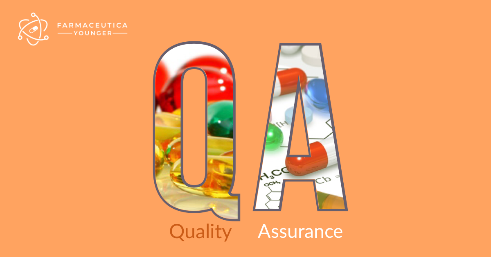

Per Quality Assurance (QA) o Assicurazione Qualità si intende quel reparto di un'Officina Farmaceutica che ha come obiettivo quello di mettere in atto tutte le precauzioni necessarie per ”assicurare” che i medicinali abbiano la qualità richiesta per l'uso a cui sono destinati.

Parte essenziale del lavoro del QA è la verifica della conformità di prodotti e processi alle norme elaborate dai vari enti regolatori internazionali, dalle norme di buona fabbricazione GMP, a quelle di buona distribuzione GDP fino alle linee guida di istituzioni come AIFA, EMA FDA, ICH etc.

Le principali mansioni svolte dal Quality Assurance sono le seguenti:

\- _Batch record review,_ ovvero la revisione dei Batch record di ciascun lotto prodotto.

\- Stesura dei [_PQR_](https://www.farmaceuticayounger.science/pharmacronimi/pqr--product-quality-review/), Product Quality Review, ovvero report redatti annualmente di tutti i lotti prodotti volti a controllare che le caratteristiche dei prodotti e i parametri critici del processo siano sotto controllo.

\- _Training al personale_, in quanto tutto il personale di un officina Farmaceutica deve essere formato e qualificato a svolgere la propria mansione. L'assicurazione qualità a tale scopo svolge training specifici al fine di garantire che tutti i dipendenti agiscano in conformità alle GMP.

\- Redige, emette e revisiona, le _Procedure operative standard_ ([SOP](https://www.farmaceuticayounger.science/pharmacronimi/sop--standard-operating-procedure/)) di sito.

\- Gestione delle _deviazioni_, delle [CAPA](https://www.farmaceuticayounger.science/pharmacronimi/capa--corrective-action/preventive-action/) e dei _Change Control_.

\- Gestione dei _reclami_ sul prodotto provenienti dal mercato.

\- Gestione delle _convalide_ di processo/ prodotto.

\- Gestione della _qualifica dei fornitori_ di materie prime, eccipienti, materiali di confezionamento, che avviene attraverso audit al fine di assicurare che forniscano prodotti della qualità adeguata e abbiano un idoneo sistema di qualità.

\- Gestione degli _Audit interni_ a tutti i reparti critici di un’officina farmaceutica al fine di assicurare il rispetto dei requisiti delle GMP.

\- Partecipazione attiva agli _Audit_ che l’officina farmaceutica subisce periodicamente da parte di enti regolatori (AIFA, FDA, enti di certificazione ISO).

A cura di Luigi Barone
