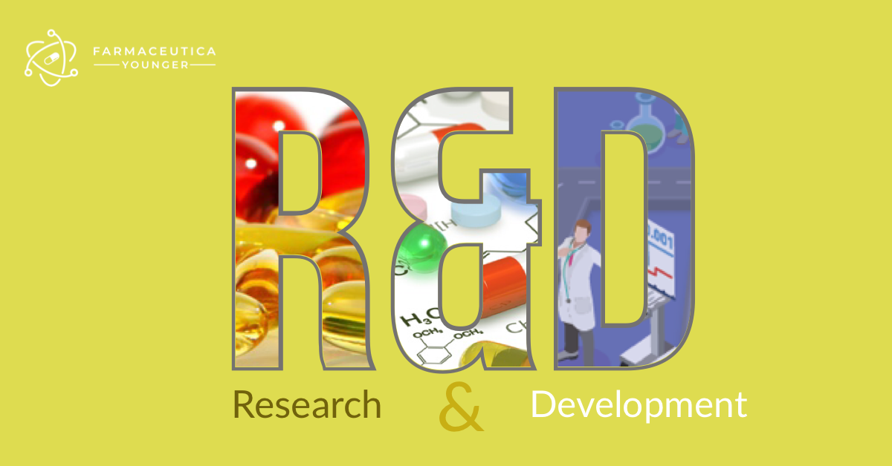

L'R&D (Research & Development) o più comunemente Ricerca e Sviluppo è quel reparto di un’officina farmaceutica il cui obiettivo è quello di migliorare i prodotti del proprio portafoglio, di crearne di nuovi, o di migliorarne i processi di produzione portando un'innovazione tecnologica nell'azienda.

Da un lato quindi si focalizza su attività di supporto per la gestione dei prodotti già presenti nel por aziendale e dall’altro ha lo scopo di concorrere all’innovazione attraverso lo sviluppo di nuovi prodotti farmaceutici in aree terapeutiche consolidate o in nuovi scenari terapeutici.

Al fine di garantire la produzione di dati sperimentali affidabili e test riproducibili è fondamentale che i laboratori R&D lavorino in conformità con le GLP (Good Laboratory Practice), cioè le norme di buona gestione di un laboratorio farmaceutico.

Secondo un recente rapporto presentato da [IQVIA](https://www.iqvia.com/-/media/iqvia/pdfs/institute-reports/the-changing-landscape-of-research-and-development.pdf), lo sviluppo di nuovi farmaci rimane un processo lento. Negli Stati Uniti nel 2018, il tempo per il lancio di una nuova molecola in media è di 13,7 anni dal momento della domanda di brevetto, circa due anni più velocemente rispetto ai farmaci lanciati nei due anni precedenti e quasi 6 mesi più veloce della media degli ultimi cinque anni. Le 15 più grandi società farmaceutiche, hanno investito, per la prima volta, più di 100 miliardi di dollari per sostenere le spese di ricerca e sviluppo delle loro attività nel 2018, con un aumento del 32% rispetto agli ultimi cinque anni.

A cura di Luigi Barone
