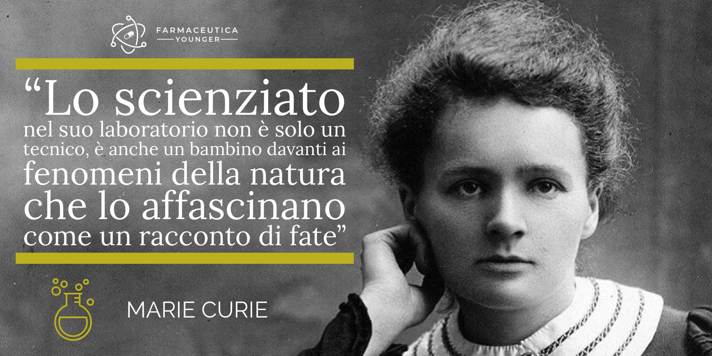

**Marie Curie** amava così tanto la scienza e il suo lavoro che, alla fine, la sacrificó con la sua stessa vita. Morì a causa dell'anemia aplastica, malattia contratta a causa della lunga esposizione alle radiazioni.

È stata la prima donna e l'unico scienziato a vincere due premi **Nobel** per la chimica e la fisica. Lavoró per quasi tutta la sua vita sulla pechblenda, un minerale cristallino, da cui isoló il **polonio**, chiamato così in onore della patria della scienziata e, successivamente il **radio** lasciando così una sua personale impronta nell'evoluzione della scienza.
