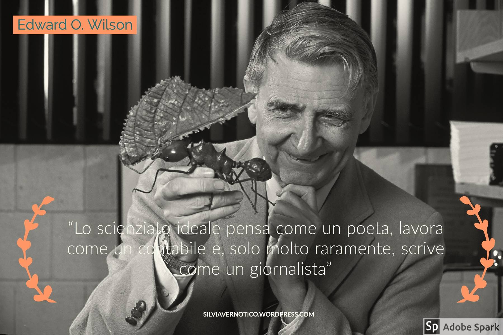

Edward Osborne Wilson (Birmingham 1929), ricercatore e professore emerito di Entomologia all’Università di Harvard, è uno dei più importanti biologi evoluzionisti viventi, padre della moderna **sociobiologia** (intesa come lo studio sistematico dell'evoluzione biologica del comportamento sociale), guru ambientalista, due volte premio Pulitzer per la scienza e da anni in predicato di Nobel.

**_Il «Times» lo ritiene una delle 25 persone più influenti d'America. _**

Wilson fece lunghi studi sistematici sul comportamento degli insetti, ed in particolar modo delle formiche. Uno degli obiettivi primari dello studioso è stato quello di fondare un campo di indagine a metà strada tra le scienze della natura e le discipline sociali. Wilson dedica ormai da vent’anni le sue energie a una appassionata e documentata difesa della biodiversità minacciata dalle attività umane, attraverso la _EO Wilson Biodiversity Foundation_.
