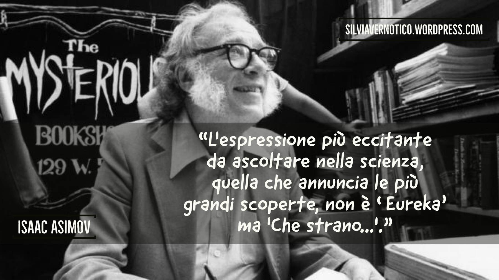

**Isaac Asimov,** il “profeta” dellarobotica,è uno dei più grandi romanzieri del Novecento, di sicuro il massimo rappresentante della narrativa di fantascienza. Nato in Russia nel 1920, in un piccolo villaggio a sud-est di Mosca, a tre anni si trasferisce con la famiglia a New York. Si laurea in chimica alla Columbia University ma è la scrittura la sua vera passione. Isaac Asimov è uno stakanovista della parola: in 50 anni scrive 40 romanzi e oltre 380 racconti, trascorrendo le sue giornate alla scrivania, con le tapparelle abbassate per evitare distrazioni.

Inizia a scrivere di robot giovanissimo, nel 1939. Nel 1942 è **il primo a utilizzare la parola Robotica**,in un racconto pubblicato sulla rivista americana "Astounding Science Fiction". Con lui la fantascienza diventa un genere letterario.

_“Sono dovuti passare oltre quarant’anni prima che scoprissi di essere un profeta”_,

dichiarò Asimov.

E in effetti è stato più di un precursore: ha precorso i tempi, inventandosi i **robot positronici**, robot umanoidi, **automi** che ubbidiscono alle **tre leggi della robotica**, un escamotage narrativo per evitare che si ribellino al loro padrone.

Isaac Asimov è morto nel 1992 ma la sua eredità, oggi, è più forte che mai. Con le sue opere ha ispirato e continua a ispirare non solo romanzi dello stesso genere ma anche serie televisive e film sui robot di grande successo. Tra i titoli più noti, la saga di Guerre Stellari, Star Trek: The Next Generation, Io Robot, L’Uomo Bicentenario e il film di animazione Light Years.
