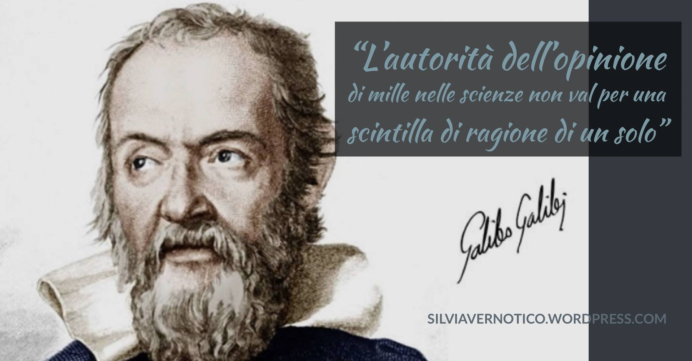

Fisico e astronomo italiano, **Galileo Galilei** è ritenuto il fondatore del metodo scientifico moderno. Il suo contributo all'astronomia osservazionale è stato immenso, guadagnandosi un posto come uno dei più grandi scienziati di tutti i tempi, notevole per il suo uso del metodo scientifico per scoprire come funziona l'universo. E così che il suo collega, l'astrofisico e cosmologo britannico **Stephen Hawking** lo suole ricordare:

_"Galileo, perhaps more than any other single person, was responsible for the birth of modern science."_

All'inizio della sua carriera si dedica agli studi di fisica, in particolare alla _caduta dei corpi_, sostenendo, al contrario di quanto si riteneva all'epoca, che velocità di caduta non dipenda dal peso, ma dalla resistenza che l'aria oppone all'oggetto. Effettua perciò diversi esperimenti. Mai prima d’ora uno scienziato aveva effettuato verifiche e misurazioni dei dati.

Nel 1592 Galileo è all'Università di Padova, dove insegna geometria e astronomia. Al centro del dibattito astronomico di questi anni c’è la teoria eliocentrica. Nicolò Copernico ha avanzato l’ipotesi che la Terra giri intorno al Sole insieme agli altri pianeti, e che non sia perciò al centro dell'universo come sostengono la Chiesa e il sapere tradizionale. Interessato alla questione, nel Galileo ricorre a uno strumento inventato qualche anno prima in Olanda: il _cannocchiale_, aggiunge lenti per aumentarne la potenza e lo punta verso il cielo. Il cielo che Galileo vede attraverso questo strumento è completamente diverso da come il sapere tradizionale lo concepisce: scopre quattro satelliti intorno a Giove, studia la superficie lunare, individua le fasi di Venere, calcola i movimenti dei pianeti. Le scoperte di Galileo fanno scalpore.

Nel 1632 pubblica il _"Dialogo sopra i due massimi sistemi del mondo"_ in cui porta nuovi argomenti a supporto della teoria eliocentrica. La reazione della Chiesa è immediata: Galileo viene processato. È costretto a rinnegare le sue teorie e viene condannato al carcere a vita.
