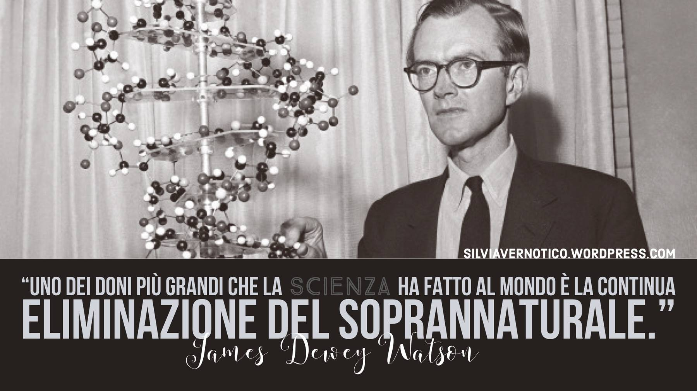

**James Watson**, biologo statunitense, **premio Nobel in medicina nel 1962** è uno degli scienziati più famosi del ‘900 ma anche uno dei più controversi, per le sue clamorose affermazioni sull'inferiorità genetica dei neri. Celebre per aver scoperto, insieme a **Francis Crick** e **Maurice Wilkins**, (con l’essenziale collaborazione di Rosalind Franklin), la struttura a **doppia elica** del **D\*\***na. \*\*

Watson iniziò a interessarsi a questioni scientifiche fin dalla più tenera età, dedicandosi ad esempio assieme al padre all’ osservazioni degli uccelli e finendo anche per partecipare, appena dodicenne, a “Quiz Kids”, un popolare programma radiofonico di domande per ragazzi dall’intelligenza precoce.

Il merito di Watson e Crick fu quello di scoprire la struttura “a doppia elica” del Dna: due lunghi filamenti di molecole, i nucleotidi, avvolti a spirale. Gli scienziati studiano la posizione e le funzioni delle singole unità operative del Dna, i geni (responsabili della trasmissione dei caratteri ereditari). Le implicazioni di questi studi non sono puramente teoriche: grazie alla biologia molecolare si è potuta capire l’origine di alcune malattie e si stanno mettendo a punto nuove strategie per sconfiggerle.
