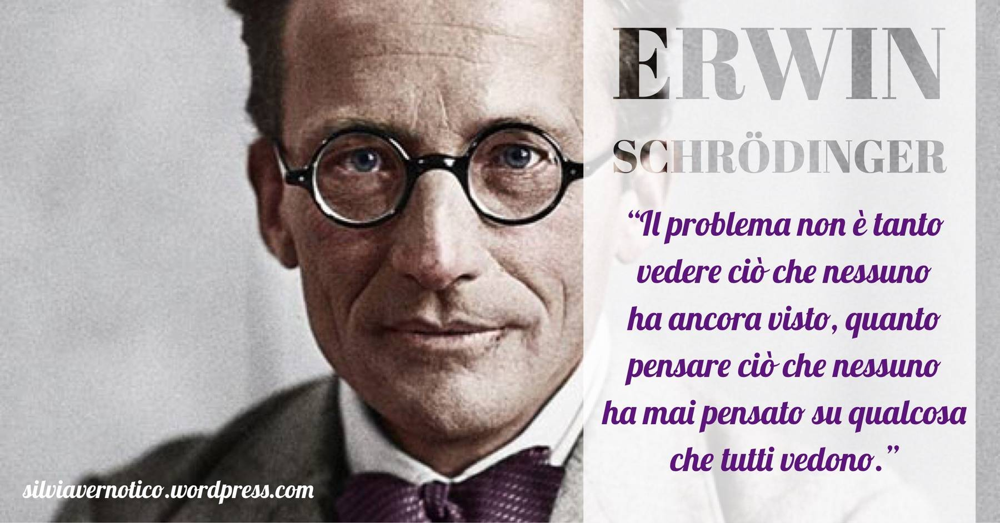

#### 

**Erwin Schrödinger**, fisico teorico austriaco, è famoso per il contributo che egli diede alla meccanica quantistica, grazie all’equazione che porta il suo nome (1926). Tale equazione descrive lo stato e l’evoluzione di un sistema quantistico nel tempo e permette di calcolare i livelli energetici degli elettroni all’interno dell’atomo.

Il suo nome è spesso associato anche al **paradosso detto «Il gatto di Schrödinger**», da lui elaborato nel 1935. Il paradosso è un esperimento mentale nel quale un gatto viene rinchiuso in una scatola dove un meccanismo può fare o non fare da grilletto all'emissione di un gas velenoso. Fintanto che la scatola rimane chiusa il gatto si trova in uno stato indeterminato: sia vivo sia morto. Solo aprendo la scatola questa "sovrapposizione di stati" si risolverà, in un modo o nell'altro. La vita del gatto è di fatto nelle nostre mani: è l'osservazione che determina il risultato dell'osservazione stessa. Così Schrödinger mette in evidenza la debolezza dell' interpretazione di Copenhagen della teoria quantistica, proposta dal fisico danese Niels Bohr.

Di temperamento anticonvenzionale e curioso, Schrödinger ebbe molti interessi anche al di fuori dell’ambito scientifico: studiò a fondo la filosofia antica, scrisse poesie e si occupò anche di biologia, alla ricerca di un possibile collegamento tra il mondo quantistico e quello dei fenomeni biologici. Si occupò anche di **termodinamica e di relatività.**

Per i suoi contributi alla teoria dei quanti, **nel 1933 ricevette il Premio Nobel per la fisica.**
