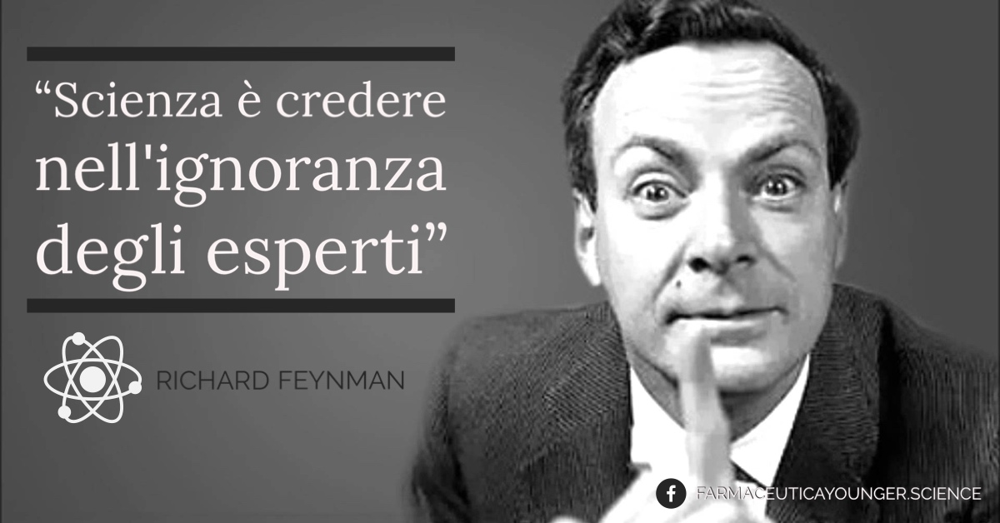

**Richard Feynman** è stato uno dei fisici teorici più notevoli e dotati di qualsiasi generazione. Il suo contributo scientifico è stato enorme soprattutto per l'elaborazione della **teoria elettrodinamica quantistica**, una teoria quantistica del campo elettromagnetico che coniuga la relatività ristretta alla meccanica quantistica per migliorare la comprensione dell'Universo per cui ricevette il **Premio Nobel per la Fisica nel 1965.**

I suoi interessi spaziavano anche nel mondo della chimica, biologia e elettronica. A lui si devono i primi concetti relativi ai computer quantistici e alle nanotecnologie.

Guardando oltre l’uomo di scienza, Feynman racchiudeva nella sua persona un mix di intelligenza, creatività, humour unici. È un insegnate brillante, carismatico, anticonformista e con un senso dello humor strepitoso tanto che la BBC lo ingaggia come divulgatore in diversi documentari. Le sue lezioni di fisica tenute al California Institute of Technology, tra il 1962 e il 1964, sono entrate nel mito.

La curiosità e il dubbio lo guidano negli studi di fisica teorica, così come nella vita e nel mondo che lo circonda.

_"Come scienziati, conosciamo i grandi progressi che scaturiscono da una soddisfacente filosofia dell’ignoranza e il grande progresso che nasce dalla libertà di pensiero; è nostra responsabilità ribadire il valore di questa libertà: insegnare che il dubbio non va temuto ma accolto e discusso; esigere tale libertà è un dovere nei confronti delle generazioni a venire."_
