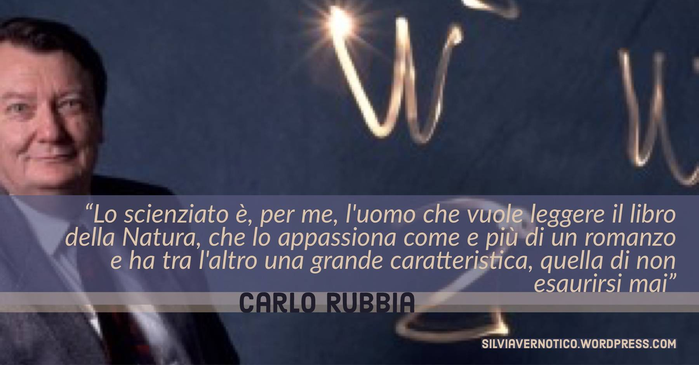

**Carlo Rubbia** è tra i più grandi uomini di scienza italiani, premio **Nobel per la Fisica nel 1984 per la scoperta delle particelle elementari W+, W-, Z** (insieme a Simon van der Meer), Senatore a vita dal 2013, fu direttore del CERN, dell’ENEA, socio onorario dell’Accademia Nazionale dei Lincei, della National Academy of Sciences americana, della Royal Society, della Pontificia Accademia delle Scienze.

Le sue ricerche riguardano molti aspetti della fisica delle particelle elementari, ma anche i problemi energetici. La sua **sensibilità alle tematiche delle energie pulite** è raffinata a tal punto da spingerlo, dopo il Nobel, a creare il progetto Reattore nucleare a fissione sicuro, conosciuto ai più forse come Amplificatore di Energia o come Rubbiatron.

_"...La conoscenza è basata sull’incertezza, sui traguardi che appaiono impossibili, sulle piccole cose che scorgiamo lontanissime, indefinite e spaventose ma che ci attraggono come un magnete. Solo gli intrepidi e gli avventurieri le vedranno da vicino. Il mondo è stato cambiato dall’eccezione, non dalla media.”_
