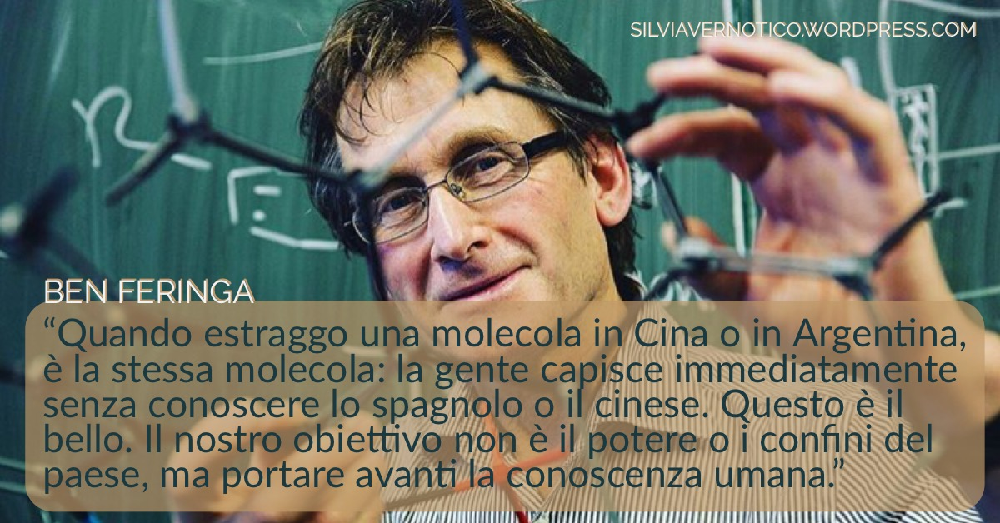

**Ben Feringa**, chimico olandese vincitore del premio _Nobel per la Chimica nel 2016_ assieme a Jean-Pierre Sauvage e J. Fraser Stoddart per la progettazione e la sintesi di macchine molecolari, nel 1999 costruì il primo **motore molecolare** (o nanomacchine molecolari, meccanismi composti da un piccolo numero di molecole ma capaci di eseguire specifici azioni, nel momento in cui ricevono energia) **capace di ruotare in maniera unidirezionale**. Feringa è riuscito a costruire una struttura chimica in cui alcune molecole, se esposte a flash di raggi ultravioletti, si muovevano di 180 gradi lungo un perno centrale: era nato il primo motore molecolare a raggi ultravioletti. Non era particolarmente veloce, ma il gruppo di Feringa è riuscito a perfezionarlo nel 2014: il motore ruota a 12 milioni di giri al secondo.

Ben Feringa ha avuto il merito di aprire un nuovo ambito di ricerca nella chimica, realizzando sistemi molecolari impensabili fino a qualche decennio fa con grandi potenzialità. Le macchine molecolari, migliaia di volte più piccole del diametro di un capello capaci di muoversi, trasportare farmaci oppure essere comandate a distanza.

_"When I draw a molecule in China or in Argentina, it is the same molecule. People understand immediately without knowing Spanish or Chinese. That is beautiful. Our common goal is not about power or borders of the country, it is about bringing forward human knowledge."_
