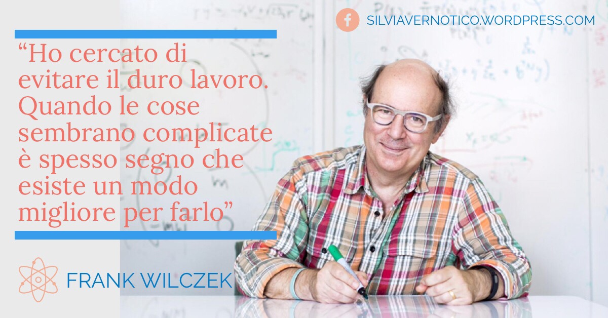

 Frank Wilczek fisico statunitense, Professore del MIT (Massachusetts Institute of Technology), premio Nobel per la Fisica nel 2004 insieme a David Gross e David Politzer, è considerato uno dei più eminenti fisici teorici del mondo. È noto soprattutto per la scoperta della libertà asintotica, dei “cristalli del tempo” (particolarissima organizzazione della materia), lo sviluppo della cromodinamica quantistica (la teoria fisica descrivente i quark e l'interazione forte), la scoperta degli assioni (ipotetica particella elementare della cromodinamica quantistica). Wilczek ha dato e continua a dare un contributo fondamentale alla fisica delle particelle fondamentali, alla cosmologia e alla fisica dei materiali. _"I actually try to avoid hard work. When things look difficult that's often a signal that there's a better way to do it!"_
