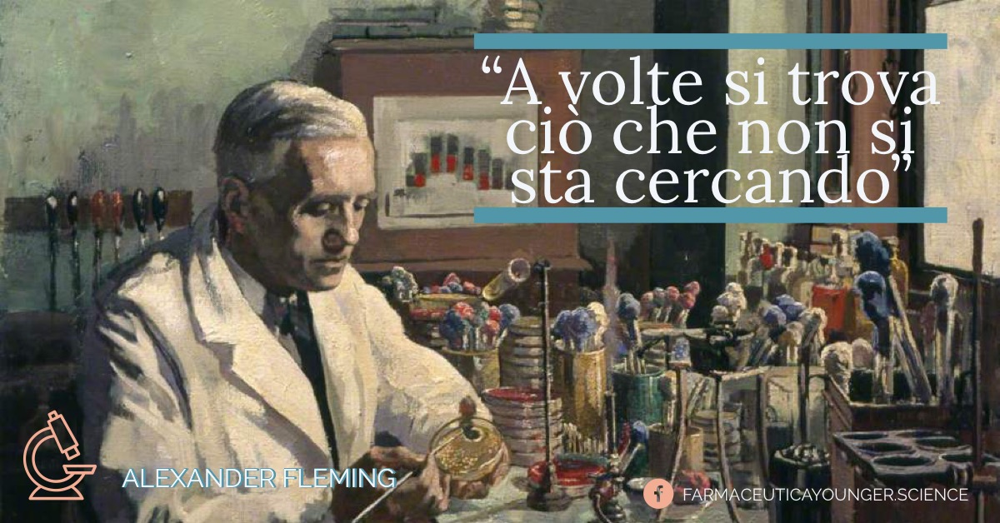

**Alexander Fleming**, medico, biologo e farmacologo scozzese, è conosciuto in tutto il mondo per la scoperta della **Penicillina** per cui ricevette il **premio Nobel per la medicina nel 1945** insieme a Ernst Chain e Howard Florey.

Nel 1929 Fleming osservò in laboratorio un evento molto strano: una piastra in cui aveva seminato delle colonie di _Staphylococcus aureus_, dopo qualche tempo non conteneva più le colonie di tale batterio. La piastra era stata accidentalmente contaminata da una muffa, _Penicillium notatum,_ che aveva causato la distruzione delle colonie di stafilococco. La muffa era capace di produrre una sostanza ad azione battericida cui fu dato il nome di _penicillina_.

Il merito di Fleming fu di riconoscere ed interpretare adeguatamente osservazioni frutto di circostanze "fortuite", aprendo in questo modo le porte allo sviluppo della moderna terapia antibiotica, permettendo di iniziare ad affrontare malattie che per lungo tempo erano risultate molto gravi ed in alcuni casi mortali: la tubercolosi, le broncopolmoniti e le infezioni suppurative postoperatorie.

Fleming non cercò mai di sminuire il ruolo della "fortuna" nella sua scoperta che guidata soprattutto da una mente scientifica seppe trasformare in una scoperta straordinaria, e durante una conferenza presso la Harvard University disse:

_«Nelle nostre vite il caso può avere un’influenza impressionante e, se posso dare un consiglio ai giovani ricercatori, mai ignorare un avvenimento fuori dal comune»_
