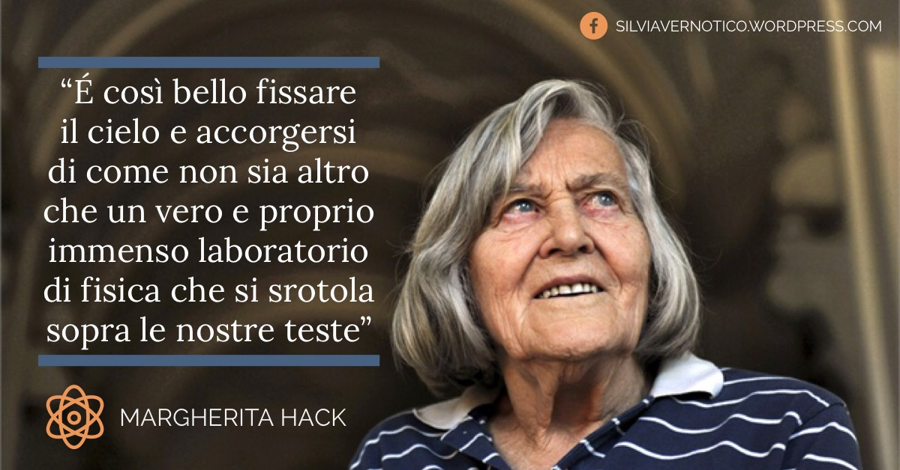

**Margherita Hack**, astrofisica, accademica e divulgatrice scientifica italiana è stata una delle menti più brillanti della comunità scientifica italiana contemporanea. Prima donna a dirigere un osservatorio astronomico in Italia dandogli lustro a livello internazionale, ha svolto un'importante attività di divulgazione e ha dato un considerevole contributo alla ricerca per lo studio e la classificazione spettrale di molte categorie di stelle.

Il 12 giugno, Margherita Hack avrebbe compiuto 96 anni e il 29 giugno ricorreranno i cinque anni dalla scomparsa di una scienziata che è stata anche una grande insegnante e divulgatrice:

_"Malgrado le difficoltà incontrate, non sono poche le scienziate che hanno portato importanti contributi allo sviluppo della scienza. La storia ci tramanda i nomi di alcune famose scienziate. Ce ne furono una ventina nell’antichità, fra cui emerge il nome della matematica Ipazia; solo una decina nel medioevo, soprattutto nei conventi, quasi nessuna tra il 1400 e il 1500, 16 nel 1600, 24 nel 1700, 108 nel 1800. Oggi solo nel campo dell’astronomia sono più di 2000, ed in ogni campo dei sapere le ricercatrici universitarie superano il 50%, con punte ded’80% nelle facoltà umanistiche, del 60% in quelle di scienze biologiche, dal 30 al 40% nelle scienze abiologiche, più dei 50% nelle matematiche, mentre sono ancora al di sotto dei 20% in facoltà come ingegneria e agraria..._

_Io ho avuto la fortuna di avere una famiglia in cui babbo e mamma erano perfettamente eguali, si dividevano i compiti in piena parità, e che non mi hanno mai imposto comportamenti o giocattoli legati a stereotipi sessuali. Anche lo sport che ho praticato per parecchi anni mi ha aiutato a sviluppare quella competitività che e necessaria per riuscire nell’atletica come nella scienza, per vincere sportivamente, allenandosi e studiando e avendo la costanza di perseguire lo scopo di battere un record o di ottenere un risultato scientifico, senza scoraggiarsi davanti agli insuccessi, perseverando con costanza._ _Credo perciò che l’ambiente familiare in cui ho avuto la fortuna di nascere sia stato estremamente importante per darmi fiducia nelle mie possibilità, e per non provare complessi di inferiorità che ho spesso notato in colleghe della mia generazione e anche più giovani..._

_ Sta alle giovani donne educare i propri compagni e ai giovani uomini di incitare le loro compagne ad affermarsi nella vita."_
