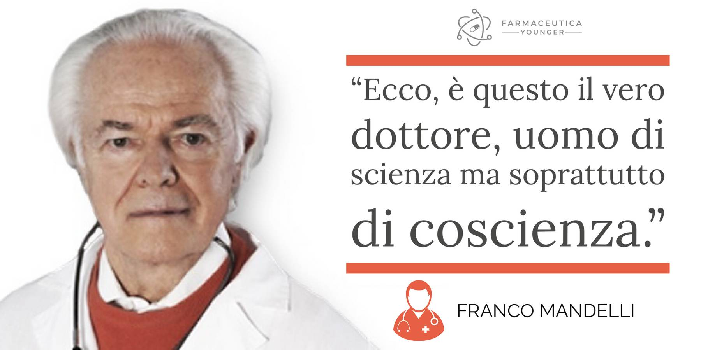

**Franco Mandelli**, medico ed uno dei più importanti ematologi italiani, Professore emerito dell’Università Sapienza e Primario emerito del Policlinico Umberto I di Roma, pioniere della lotta alle neoplasie del sangue (leucemie) e del sistema linfatico (linfomi), presidente del **GIMEMA** (Gruppo Italiano Malattie Ematologiche dell'Adulto) e dell'**AIL** (Associazione italiana contro le leucemie-linfomi e mieloma) ci ha lasciato il 15 Luglio 2018, all'età di 87 anni.

Per comprendere l'importanza della sua ricerca basti pensare che prima dei suoi innovativi protocolli terapeutici, in Italia di leucemia acuta si moriva. Le sue ricerche furono incentrate sulla cura delle leucemie e dei linfomi che gli hanno permesso l'elaborazione di protocolli terapeutici innovativi, che hanno dato luogo a risultati pratici di notevole valore. L’innovazione riguardò il modo di aggredire le cellule con una chemioterapia «taglia-globuli bianchi» che li faceva sparire dal midollo indistintamente, buoni e cattivi. Avevano osservato che nel ricostituirsi, i primi erano più veloci dei secondi. Fu l’avvio di una diversa cultura nell’approccio ai tumori. Indiscusso il ruolo fondamentale che ebbe nella nascita e nello sviluppo dell’Ematologia italiana come disciplina a sé stante. È stato autore di oltre 700 pubblicazioni scientifiche sia in Italia che all’estero.

Il nome di Mandelli resterà per sempre legato all’AIL (Associazione Italiana contro le leucemie i linfomi e il mieloma), nata nel 1969, poderosa macchina di volontari, presenti in ogni provincia italiana ed ancora, alla _Partita del Cuore_ e alla maratona televisiva _Trenta Ore per la vita_. Oltre la metà della sua vita l'ha trascorsa coltivando il sogno di debellare le malattie oncoematologiche ed è sicuramente a lui che dobbiamo un grazie nell'aver contribuito a rendere migliore la nostra società grazie alla sua personale lotta contro la la leucemia e gli altri tumori del sangue.

Per la sua attività scientifica e di solidarietà ricevette numerosi premi e riconoscimenti, fra i quali l’onoreficenza di Cavaliere di Gran Croce della Repubblica Italiana e la medaglia d’oro al merito della sanità pubblica.

> Ho sempre creduto, fin dai miei inizi, che il vero dottore fosse il medico condotto di un tempo, che doveva occuparsi di tutto anche se non poteva sapere tutto, aiutato in questa dal rapporto d'amore con i propri pazienti. Ecco, è questo il vero dottore, uomo di scienza ma soprattutto di coscienza.
