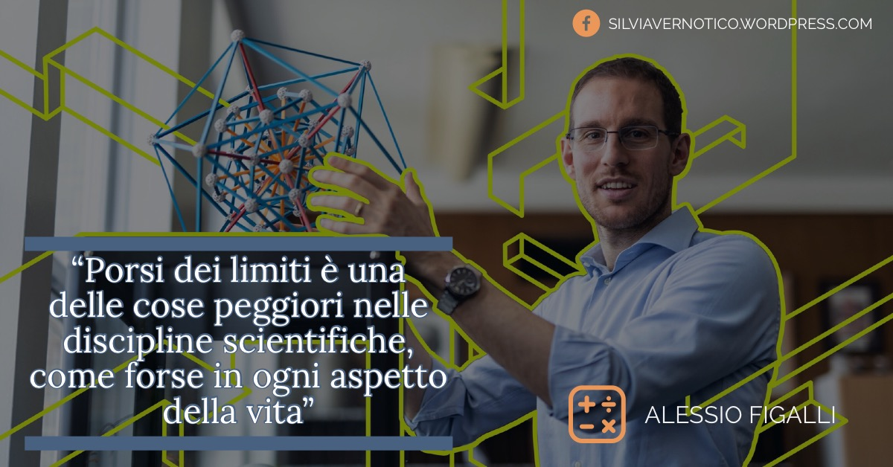

**Alessio Figalli,** 34 anni, romano di origine, normalista di formazione, professore di matematica al Politecnico di Zurigo, è il **vincitore della medaglia Fields nel 2018**, l'equivalente del "Nobel" per la matematica. Figalli è il secondo italiano in 82 anni di storia a ricevere il riconoscimento, un premio conferito ogni quattro anni dall’Unione matematica internazionale ai matematici più affermati al mondo con meno di 40 anni di età. La Commissione internazionale dei matematici ha scelto lui in virtù dei _«suoi contributi alla teoria del trasporto ottimale e alle sue applicazioni nelle equazioni differenziali a derivate parziali, metrica geometrica e probabilità»_.

Figalli ha lavorato alla **teoria del trasporto ottimale**, su cui ha scritto la sua tesi di dottorato, che consiste come lui stesso lo ha definito "nello studio di come trasferire una distribuzione di massa da un luogo a un altro in maniera ottimale".

I teoremi di Figalli affrontano una moltitudine di problemi, e non si limitano a essere risultati teorici: hanno applicazioni ingegneristiche e fisiche, e permettono una maggiore comprensione di fenomeni naturali come le bolle di sapone, la meteorologia e la formazione delle nuvole.

I suoi studi sono la prova che la matematica non è arida e astratta.

_"Le applicazioni possono andare ben oltre le aspettative, ma è solo lasciando la possibilità agli scienziati di far galoppare la fantasia che si possono ottenere questi risultati"._
