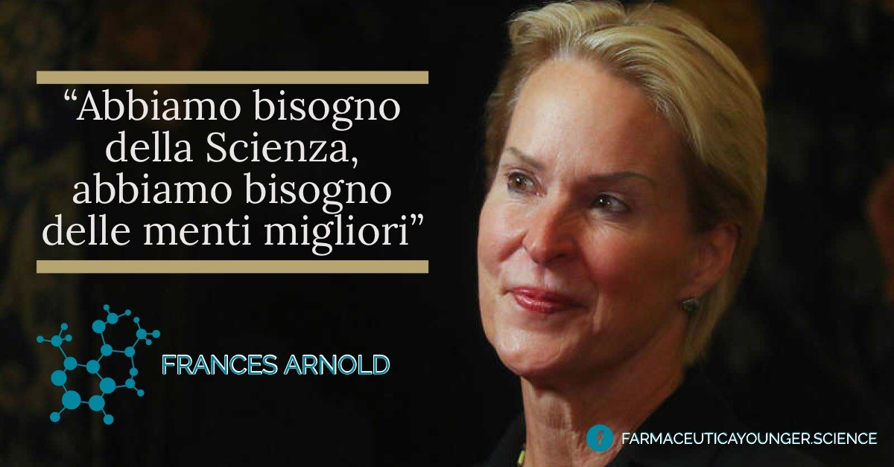

Frances Hamilton Arnold, biochimica e ingegnera statunitense, co-inventrice di oltre 40 brevetti negli Stati Uniti, co-fondatrice di Gevo Inc., una società per la produzione di carburanti e prodotti chimici da fonti rinnovabili, è la vincitrice del Premio Nobel per la Chimica 2018, insieme a George P. Smith e Sir Gregory Paul Winter, "per i loro lavori su enzimi, peptidi e anticorpi".

Il metodo della cosidetta “evoluzione diretta” di Arnold consiste nell'indurre mutazioni casuali nel DNA, proprio come accade in natura, per poi selezionare quelle più efficienti e ripetere il processo in più fasi successive, fino a raggiungere l'obiettivo richiesto dal settore di applicazione. Le sue ricerche si sono focalizzate sulla subtlisina, un enzima che catalizza le reazioni chimiche in soluzioni a base di acqua, utilizzando un solvente organico, la dimetilformammide (DMF). Realizzò alcune mutazioni casuali nel codice genetico dell’enzima e le inserì poi nei batteri, in modo che producessero varianti di subtlisina. Per capire quali varianti fossero le più efficienti e sapendo che la subtlisina scompone la caseina, selezionò le varianti dell’enzima che svolgevano meglio questo compito in una soluzione di latte e DMF. Gli enzimi selezionati furono la base per produrne di nuovi sempre più efficienti, e così via, dirigendo l’evoluzione dell’enzima verso uno specifico compito. Da qui l'appellativo di “evoluzione diretta”.

Arnold è stata una pioniera di questa tecnica, che da allora è stata raffinata ed è oggi usata dalle aziende e dai laboratori di tutto il mondo per rendere più efficiente la produzione di medicinali, biocarburanti e nuovi materiali.
