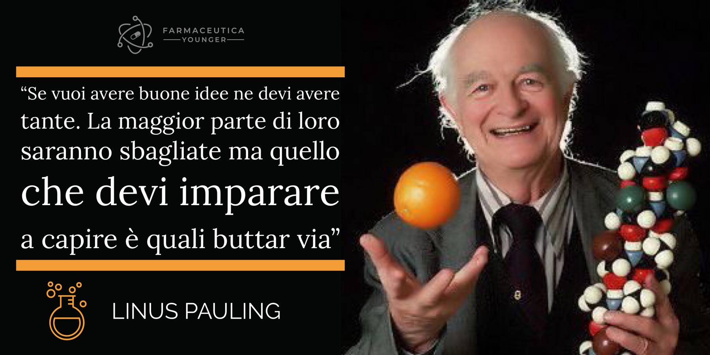

**Linus Carl Pauling**, chimico, cristallografo e attivista statunitense, tra i più celebri scienziati del XX secolo è stato uno dei pochi vincitori di due premi Nobel, per la Chimica nel 1954 e per la Pace nel 1962. Pauling è stato l'unico tra i doppi vincitori del Nobel a non averlo condiviso con altre personalità.

Pauling è considerato il padre del legame chimico e a lui si deve l'applicazione della meccanica quantistica per determinare la struttura delle molecole e la natura dei legami. Gran parte dei suoi studi sono stati dedicati a stabilire le configurazioni spaziali delle molecole e la loro influenza sulle interazioni inter- e intramolecolari. Determinò tramite raggi X la conformazione tridimensionale di vari amminoacidi e dipeptidi, stabilendo la struttura e le proprietà chimiche del legame peptidico, studi che lo portarono alla definizione della struttura secondaria delle proteine, da lui distinta in elicoidale e a foglietto ripiegato (o β-struttura). Pauling spiegò inoltre il concetto di affinità chimica, introdusse il concetto di orbitali ibridi, di carattere ionico parziale di un legame covalente e compilò la più nota scala dell'elettronegatività.

Oltre ad essere stato un grande scienziato, Pauling fu un grande attivista. Presentò all'ONU una petizione per il bando degli esperimenti nucleari, si impegnò per il controllo delle armi nucleari e per il bando degli esperimenti, ricevendo il premio Nobel per la Pace.

> If you want to have good ideas you must have many ideas. Most of them will be wrong, and what you have to learn is which ones to throw away.
