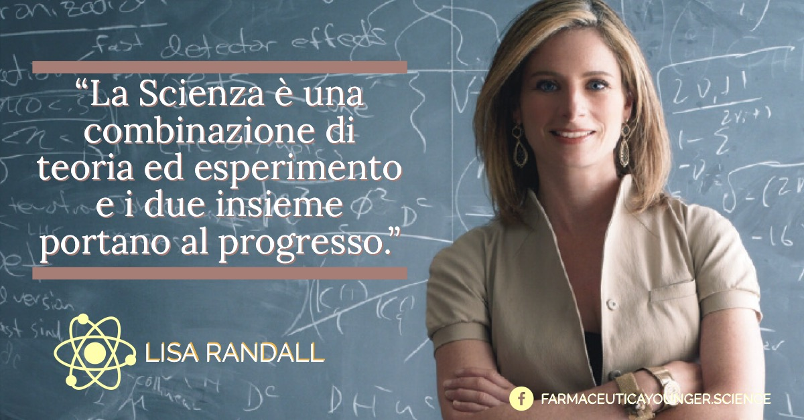

**Lisa Randall**, fisica statunitense, specializzata in fisica delle particelle e cosmologia, membro della American Academy of Arts and Sciences e della American Physical Society, è stata la prima donna a essere titolare di una cattedra al dipartimento di fisica della Princeton University e a quello di fisica teorica del Massachusetts Institute of Technology e della Harvard University.

I campi della fisica teorica nei quali Randall è impegnata comprendono la* teoria multidimensionale delle stringhe*, la genesi dei _barioni_ (particelle elementari pesanti, come protoni e neutroni, a loro volta fatti di quark), la cosmologia e la _teoria dell’inflazione_ (fase di rapidissima espansione dell’universo che si sarebbe verificata a infinitesime frazioni di secondo dal Big Bang), il Modello Standard delle particelle elementari.

Time Magazine l'ha inclusa nell'elenco delle cento persone più influenti del 2007. È autrice di numerosi libri tra cui spicca _"Passaggi curvi"_ che è stato inserito dal New York Times nell’elenco dei libri più importanti del 2005.

> "Science is a combination of theory and experiment and the two together are how you make progress."
