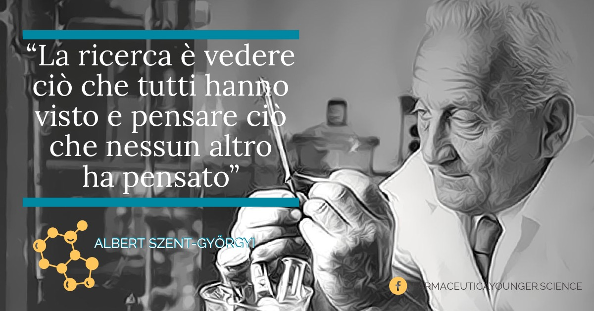

**Albert von Szent-Gyorgyi**, biochimico e scienziato ungherese, è stato vincitore del Premio Nobel per la Fisiologia e Medicina nel 1937 "per le sue scoperte connesse al processo di combustione biologica, con particolare riferimento alla **vitamina C** e alla catalisi dell'acido fumarico".

I suoi studi sulla vitamina C furono rivoluzionari. Basti pensare che durante i grandi viaggi oceanici, cominciati nel 1500, lo scorbuto mieteva molte vittime fra i marinai, fino a quando, nel Settecento, si vide che le morti diminuivano se le navi portavano a bordo delle scorte di frutta e verdura fresca. Szent-Gyorgyi scoprì che una sostanza che lui estrasse dall'arancio, chiamata da lui _acido esuronico_ e successivamente ribattezzata acido ascorbico, era in grado di prevenire lo scorbuto. Per proseguire gli esperimenti occorreva disporre di una certa quantità della sostanza e Szent-Gyorgyi scoprì che i peperoni, coltivati su larga scala intorno a Szeged, dove insegnava, ne avevano una elevata concentrazione e ne estrasse da questi una quantità sufficiente da permetterne l'identificazione.

Compì inoltre fondamentali studi sulla biochimica della vitamina C, sui processi ossidoriduttivi, sull'azione catalitica dell'acido fumarico e sulla fisiologia del tessuto muscolare. Tra i suoi numerosi altri contributi sono anche da annoverare quelli sulla struttura molecolare delle proteine, sulla riboflavina, su alcune sindromi avitaminosiche e sui flavoni contenuti nel succo di limone e nella paprica, capaci di influenzare la resistenza e la permeabilità dei capillari sanguigni.

> ... to see what everyone else has seen, but think what no one else has thought.
