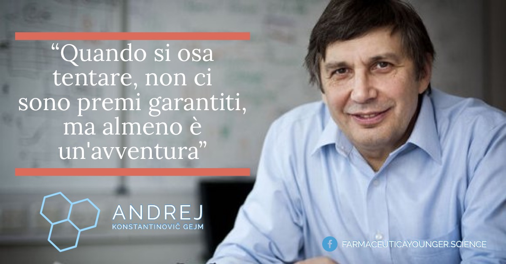

**Andrej Konstantinovič Gejm**, fisico sovietico naturalizzato olandese, Professore di fisica all'Università di Manchester, dove dirige il Centre for Mesoscience and Nanotechnology, ricopre la carica di _Langworthy Professor_ all'Università di Manchester e di _2010 Anniversary Research Professor_ della Royal Society, è stato il vincitore del **Premio Nobel per la fisica nel 2010** insieme a Konstantin Novosëlov, suo collega all'Università di Manchester, "per i pionieristici esperimenti riguardanti il **grafene**".

I due colleghi giunsero quasi per caso alla scoperta del grafene. Mentre utilizzavano scaglie di grafite, al fine di ottenere scaglie sempre più sottili, A. Gejm e K. Novosëlov idearono un metodo, conosciuto come metodo “scotch-tape” che consiste nell'esfoliazione meccanica della grafite. In pratica, utilizzarono semplicemente del nastro adesivo per strappare strati sottili da un pezzo di grafite. L'operazione di esfoliazione meccanica, ripetuta più volte sugli stessi frammenti di grafite, consentì di ottenere strati di spessore infinitesimo. L'analisi di questi strati sottili mostro' che alcuni di essi avevano lo spessore di un solo atomo: era stato isolato il grafene.

Gejm è noto inoltre per lo sviluppo del **Gecko tape**, un adesivo biomimetico ispirato alle proprietà adesive del geco, per gli studi sulla levitazione diamagnetica, che ha dato luogo alla famosa dimostrazione della rana volante (la levitazione di una rana viva nel campo magnetico generato da un solenoide di Bitter), grazie al quale Gejm ha ricevuto nel 2000 il **Premio Ig Nobel** (conosciuto anche come premio Ignobel che viene assegnato annualmente a dieci ricercatori autori di ricerche strane, divertenti, e assurde), condiviso con Sir Michael Berry della Università di Bristol, divenendo così la prima persona ad aver vinto entrambi i premi.

> When one dares to try, rewards are not guaranteed but at least it is an adventure.
