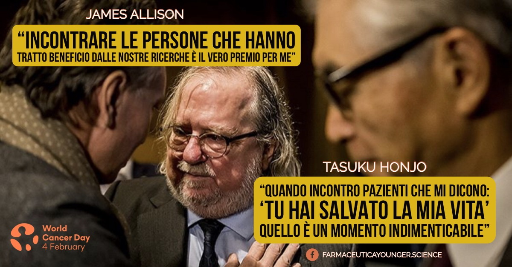

**James P. Allison **e **Tasuku Honjo** hanno ricevuto il Premio Nobel per la Medicina nel 2018 “for their discovery of cancer therapy by inhibition of negative immune regulation”. Le loro ricerche hanno portato alla luce i meccanismi con i quali le cellule del sistema immunitario attaccano quelle tumorali.

James P. Allison è immunologo americano e dal 2004 ha condotto le sue ricerche nel Memorial Sloan-Kettering Cancer Center di New York. Allison negli anni ‘90 ha scoperto la CTLA-4, la proteina che frena l’attivazione dei linfociti T, i “soldati” del nostro sistema immunitario. Bloccando la proteina CTLA-4, le cellule T rispondono efficacemente scatenando il sistema immunitario contro le cellule cancerose. Tasuku Honjo è un immunologo giapponese e ha lavorato a lungo fra Giappone e Stati Uniti, tra le università di Kyoto e Osaka, la Carnegie Institution di Washington e i National Institutes of Health. A distanza di due anni dal suo collega, nel 1992, lo scienziato giapponese è stato il primo a individuare un’altra proteina-freno, la PD-1.

Con il tempo entrambe le scoperte si sono tradotte in nuovi approcci per la terapia contro i tumori, aprendo lo scenario a nuove possibili cure mediche.

> Meeting the people who have benefitted from our research is the real prize for me. James Allison
>
> When I meet patients who tell me: ’You saved my life’, it is an unforgettable moment. Tasuku Honjo
