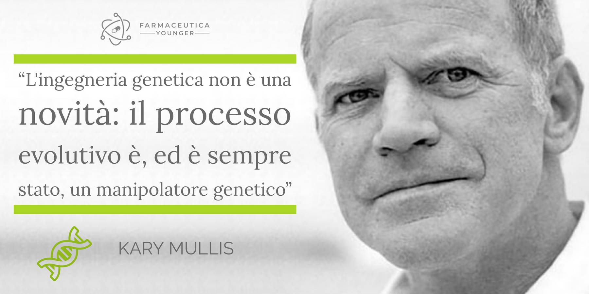

Era un tranquillo venerdì sera del 1983 e Kary Mullis era alla guida della sua Honda argentata sulla Highway 128 per raggiungere la Contea di Mendocino per un weekend di riposo. Una strada che conosceva bene tanto da poterla guidare ad occhi chiusi. Era buio e i suoi pensieri iniziarono a vagare. Filamenti di DNA si avvolgevano e volteggiano nel cielo stellato di quella magica notte. Tutti i pezzi del puzzle in un istante si ricomposero quasi per magia.

> Era tutto così banale che non riuscivo a credere che nessuno lo avesse già pensato e fatto prima.

Aveva capito che poteva ottenere un numero elevato di copie di un preciso filamento di DNA con una reazione semplice, per la quale erano già noti e disponibili tutti gli ingredienti. A Mendocino non aveva il telefono, il lunedì mattina si precipitò in biblioteca prestissimo. Parlò con molte persone fra medici e biologi che da subito non credetterò all’illuminazione di quel venerdì sera.

> Nessuno vuole che un chimico arrivi e inizi a cambiare le cose.

Kary Mullis, “su quello che fanno gli scienziati” TED talk.

Mullis era convinto e non voleva abbandonare quell’idea per niente al mondo. Contro tutti e tutto, sfidò scienziati autorevoli in nome della sua idea. Nacque così la PCR, Polymerase Chain Reaction, la tecnica che permette di amplificare frammenti di DNA dei quali si conoscono le sequenze nucleotidiche iniziali e terminali in tempi brevi. C’è voluto tempo prima che fosse intuita la portata della scoperta e perfino le prestigiose riviste Nature e Science, rifiutarono il primo lavoro di Mullis sulla PCR in quanto ”poteva essere utile solo a una ristretta cerchia di specialisti.”

Mullis ricevette il Premio Nobel per la chimica nel 1993 assieme a Michael Smith _"for his invention of the polymerase chain reaction (PCR) method."_ L’invenzione della PCR è stata di grande importanza sia nella ricerca medica che in quella forense. Da quel venerdì sera del lontano 1983 la biologia molecolare per mano di un chimico caparbio e illuminato non fu più la stessa.
