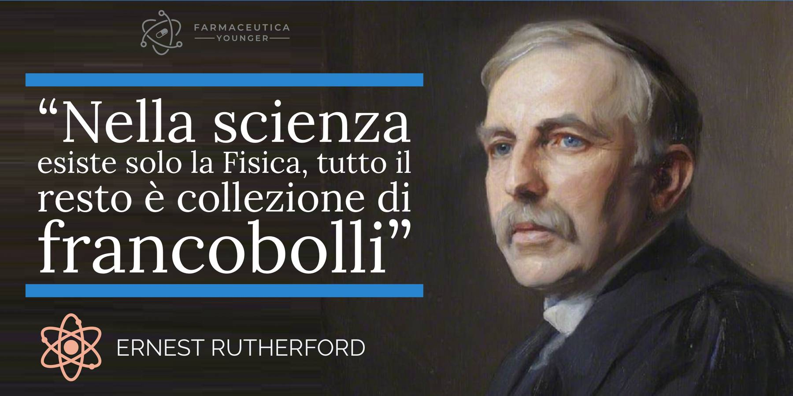

**Ernest Rutherford**, chimico e fisico neozelandese naturalizzato britannico è considerato il padre della fisica nucleare.

Rutherford vinse il **Premio Nobel per la chimica nel 1908** "per le sue ricerche sulla disintegrazione degli elementi e sulla chimica delle sostanze radioattive".

Nel 1898 gli fu assegnata la cattedra di fisica alla McGill University, in Canada, dove sviluppò il lavoro che gli avrebbe fruttato nel 1908 il Premio Nobel per la chimica dimostrando che la radioattività era la spontanea disintegrazione o trasmutazione degli atomi.

Aveva notato che in un campione di materiale radioattivo occorreva lo stesso tempo ("tempo di dimezzamento") perché metà del campione decadesse, e ideò una applicazione pratica di questo fenomeno usando questo tempo costante di decadimento come un orologio, il quale poteva essere usato per determinare l'età effettiva della Terra.

Nel 1907 ebbe la cattedra di fisica alla Victoria University di Manchester.

Qui arrivò a dimostrare il suo modello atomico, in cui l’atomo era costituito da un nucleo centrale in cui si concentrava la maggior parte della materia carica positivamente (nucleo atomico), intorno al quale ruotavano gli elettroni.

Nel 1917 raggiunse un altro importante traguardo della sua carriera: per primo riuscì a trasformare un elemento chimico in un altro, in particolare l'azoto in un isotopo dell'ossigeno, mediante una reazione nucleare.

Mentre lavorava con Niels Bohr, Rutherford ipotizzò l'esistenza di particelle nucleari neutre, i **neutroni**, che, aumentando le forze nucleari attrattive, potevano compensare l'effetto repulsivo delle cariche elettriche positive dei protoni, impedendo così ai nuclei degli atomi pesanti di disintegrarsi.

Nel 1917 ritornò al Cavendish come direttore.

Sotto la sua direzione furono assegnati premi Nobel a James Chadwick per la scoperta del neutrone, a John Cockcroft e Ernest Walton per la scissione dell'atomo mediante un acceleratore di particelle, e a Edward Victor Appleton per la dimostrazione dell'esistenza della ionosfera.

In ricordo del suo importante contributo alla chimica, gli venne dedicato un elemento chimico, il Rutherfordio.

Rutherford morì nel 1937.

In quell’anno il suo necrologio sul New York Times recitava così:

> E’ dato a pochi uomini di raggiungere l’immortalità e ancora meno sono coloro a cui è concesso raggiungere l’Olimpo mentre sono in vita. A Lord Rutherford sono riuscite entrambe le cose.
