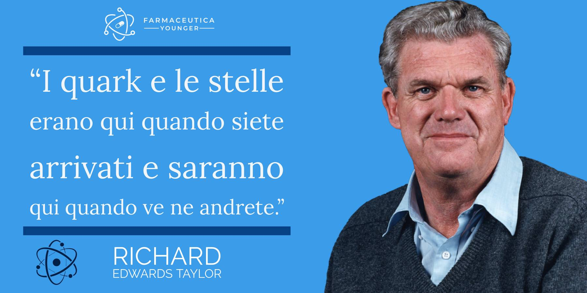

**Richard Edward Taylor,** fisico canadese naturalizzato statunitense, vincitore, insieme a Jerome Isaac Friedman e Henry Way Kendall, del premio Nobel per la fisica nel 1990, per «le loro indagini pionieristiche di fondamentale importanza per lo sviluppo del modello dei quark e della fisica delle particelle».

Nacque in un piccolo villaggio canadese, Medicine Hat, da padre canadese e madre americana.

Aveva quasi dieci anni quando iniziò la seconda guerra mondiale. Quel conflitto ebbe un grande effetto su Taylor. Il fascino bellico trasformò la città in cui Taylor viveva e allargò i suoi orizzonti.

Iniziò a sviluppare un interesse per gli esplosivi tanto da farsi saltare tre dita della mano sinistra. La bomba atomica che pose fine alla guerra accese il suo interesse nei confronti dei fisici e della fisica.

Dopo alcune difficoltà con voti bassi in alcune materie del liceo, fu ammesso all'Università di Alberta a Edmonton, dove gradualmente si interessò sempre di più alla fisica sperimentale.

Dopo la laurea iniziò la sua carriera di ricercatore a Stanford, dove entrò nel gruppo di fisica che lavorava sugli esperimenti per Slac (Centro d’Accelerazione Lineare di Stanford), che alla fine degli anni Sessanta divenne il più potente acceleratore di particelle al mondo.

Il dottorato fu solo l’inizio di una lunga carriera. Nel 1958, si trasferì a Parigi, alla Scuola Normale Superiore, dov’era in progetto un acceleratore lineare simile a quello di Stanford.

Dopo Parigi, nel 1961, tornò negli Stati Uniti dove lavorò a Berkeley e poi di nuovo a Stanford, dove cominciò il fruttuoso periodo, durato dieci anni, di lavoro allo Slac.

Taylor è stato uno dei fisici che hanno contribuito alla costruzione dello Slac.

**Il suo più grande contributo fu l'aver fornito una delle prime prove sull'esistenza dei quark che segnò una svolta fondamentale nella fisica delle particelle.**

Furono condotti esperimenti di scattering anelastico profondo, in cui gli elettroni vennero usati per bombardare protoni e neutroni. In questo modo parte dell'energia degli elettroni veniva trasferita alle particelle più grandi, a volte frantumandole, e gli elettroni venivano così deviati.

L'esperimento aveva appena dimostrato che protoni e neutroni erano costituiti da sub-particelle, i **quark**.

Persis Drell, ex direttore di SLAC ha dichiarato che gli esperimenti di Taylor e dei suoi colleghi avevano dimostrato che il protone era come "marmellata, con semi" (i quark), piuttosto che come "Una liscia gelatina".

Fra i tratti che hanno contraddistinto lo scienziato, oltre alla propensione per il lavoro di gruppo e alla modestia, non manca una certa dose di ironia. Ai suoi studenti disse:

> I quark e le stelle erano qui quando siete arrivati e saranno qui quando ve ne andrete. Non hanno il senso dell’umorismo perciò, se volete un mondo in cui più persone sorridano, dovrete pensarci voi.
